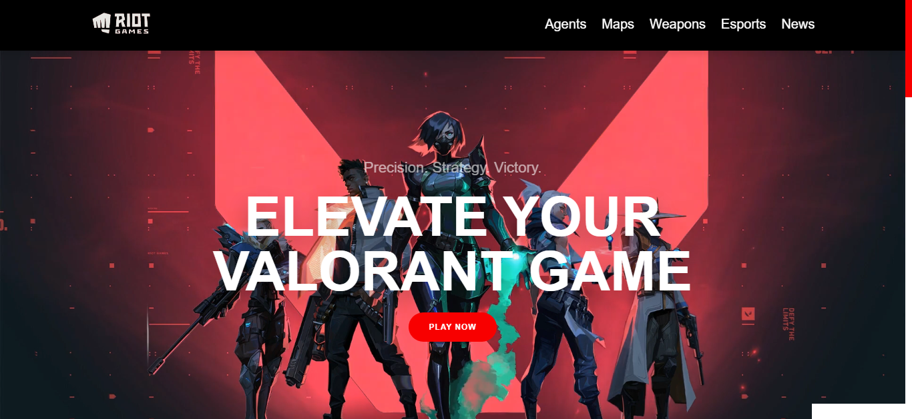

# 🎮 **Riot Gaming Clone Website** 🎮

_Valorant Web Clone. This project exist just because I want to explore animation in HTML, CSS and JavaScript. It also show you the best experience in gaming website that you had never seen!_



## 🚀 **Live Demo**

Check out the live version of the site: [Epic Gaming Website Live](https://syahmi-m0.github.io/valorantwebclone/)

## 🎯 **Features**

- 🕹️ **Game Hub:** Centralized platform for all your favorite games.
- 🌟 **Player Profiles:** Create and customize your own gamer identity.
- 🎥 **Stream Integration:** Watch live streams and stay updated on gaming events.
- 🏆 **Leaderboard:** Compete against others and climb the ranks.
- 📱 **Responsive Design:** Fully optimized for mobile, tablet, and desktop.

## 🎨 **Screenshots**

Here’s a sneak peek of our awesome UI:


## ⚙️ **Installation & Setup**

Clone the repository and install the dependencies to get started.

```bash
git clone https://github.com/yourusername/epic-gaming-website.git
cd epic-gaming-website
npm install
